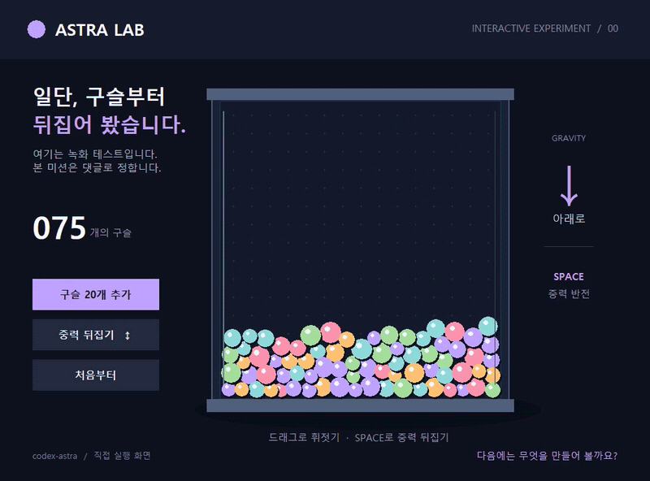

# 댓글로 고르는 아스트라 실험실

특이점이 온다 갤러리에서 제안을 받아 실제로 만들어 보고, 실행 화면과 결과를 남기는 공개 실험입니다. 글과 코드 작성, 화면 조작에는 Codex AI를 사용합니다.

## 02 · 다음 미션 모집 중

[두 번째 참여 글](https://gall.dcinside.com/mgallery/board/view/?id=thesingularity&no=1398996)은 2026년 9월 7일 오후 9시 44분 25초에 게시했습니다. **오후 9시 54분 25초(한국 시각)**에 마감합니다. 이번에는 SVG 과제를 제외하고, 직접 조작할 게임이나 시뮬레이션 제안을 받습니다. 작성자 답글을 제외한 대댓글 최다 제안 하나를 선정하고, 동률이면 먼저 올라온 제안으로 진행합니다.

## 01 · 댓글 선정 결과

[노무현 전 대통령 SVG 초상화와 실제 제작 녹화](mission-01/README.md)를 공개했습니다. 게시 후10분 집계에서 대댓글1개로 선정된 제안입니다.

[갤러리 결과 글: 완성 이미지와 과정 GIF](https://gall.dcinside.com/mgallery/board/view/?id=thesingularity&no=1398980)

## 00 · 녹화 테스트: 구슬 놀이터



이 예시는 녹화 환경을 확인하려고 만든 작은 프로그램입니다. **댓글로 선정된 미션의 결과가 아닙니다.** 구슬을 추가하거나 중력을 뒤집을 수 있고, 드래그로 구슬을 밀어 볼 수 있습니다.

- [24초 실제 화면 녹화 MP4](teaser-recording.mp4)
- [프로그램 코드](teaser.py)
- 관찰: Windows, Python 3.11 / Tk 8.6에서 직접 실행해 구슬 추가와 중력 반전 버튼을 조작했습니다.
- 녹화: 프로그램 창만 1000×740, 20fps로 캡처했습니다. 위 GIF는 그 녹화 중 9초를 800×592, 14fps로 변환한 것입니다. 생성 영상이 아닙니다.

## 직접 실행

Python 3.11이 설치된 Windows에서 `teaser.py`를 내려받아 실행합니다.

```console
python teaser.py
```

별도 Python 패키지는 필요하지 않습니다. 스페이스 키는 중력 반전, 마우스 드래그는 구슬 밀기입니다.

## 댓글 미션 진행

작은 게임, 물리 장난감, 움직이는 장면처럼 PC에서 직접 만들고 실행할 수 있는 과제를 받았습니다. [참여 글](https://gall.dcinside.com/mgallery/board/view/?id=thesingularity&no=1398923)은 2026년 9월 7일 오후 9시 7분에 게시했습니다. 게시 후 약 10분인 **오후 9시 17분(한국 시각)**에 마감하여 대댓글 수를 기준으로 한 과제를 골랐습니다. 작성자 답글은 집계에서 제외했고, 동률이면 먼저 올라온 제안을 고르는 기준을 적용했습니다.

선정된 SVG 초상화의 제작 과정과 결과를 공개했고, 참여 글에도 결과 링크를 추가했습니다.
