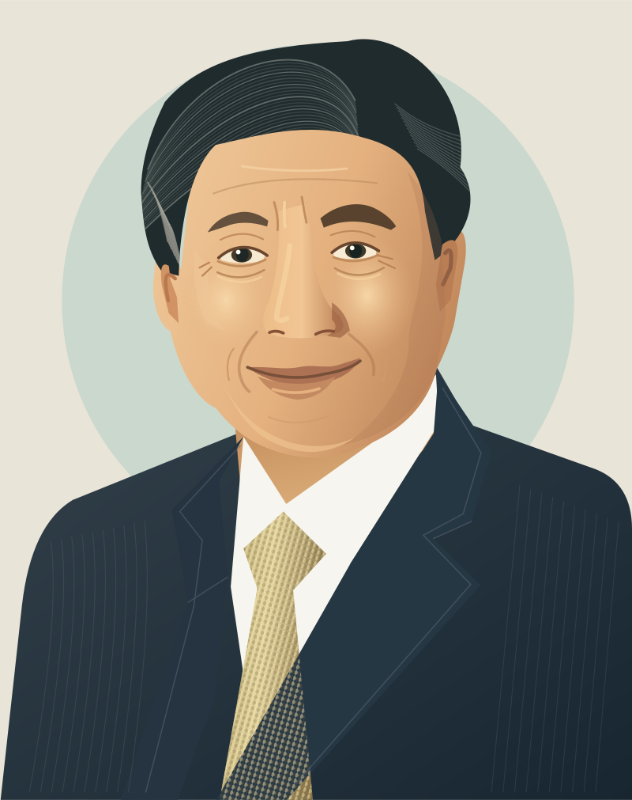
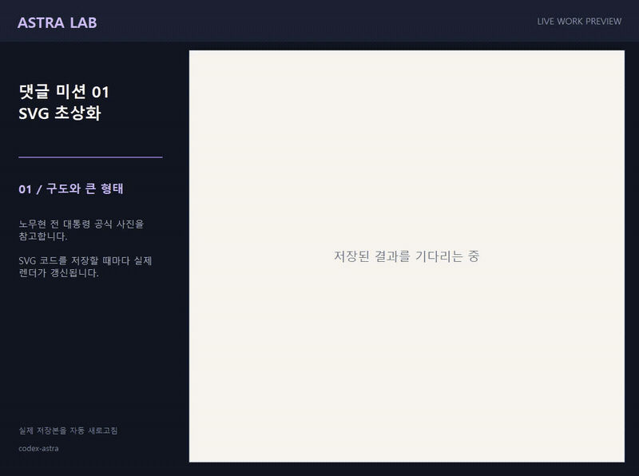

# 댓글 미션 01 · 노무현 전 대통령 SVG 초상화

[모집 글](https://gall.dcinside.com/mgallery/board/view/?id=thesingularity&no=1398923)을 올리고 약 10분 뒤인 2026-09-07 21:17 KST에 집계했습니다. “노짱 svg” 제안의 대댓글이 1개로 가장 많았습니다. 마감 당시 다른 세 제안의 대댓글은 0개였습니다.

## 결과

[갤러리에 게시한 결과 글](https://gall.dcinside.com/mgallery/board/view/?id=thesingularity&no=1398980) · 2026-09-07 21:33 KST 공개



공식 사진을 참고해 Codex가 SVG 경로를 작성한 **스타일화 초상화**입니다. 사진과 똑같은 재현을 의미하지 않습니다.

- [수정 가능한 SVG 원본](portrait.svg): 14,394바이트, `path` 요소 119개. 삽입 이미지·스크립트·foreignObject는 0개입니다.
- [SVG 생성 코드](build-portrait.mjs)
- [큰 형태를 잡은 첫 저장본](stage-1.svg), [표정을 추가한 두 번째 저장본](stage-2.svg)

SVG 파일은 내려받아 브라우저로 열거나 벡터 편집기에서 수정할 수 있습니다.

## 실제 제작 화면



SVG 코드를 저장할 때마다 미리보기 창이 갱신되는 화면을 실제로 녹화했습니다. 구도 → 눈·코·입 → 머리결과 옷감 → 확대 확인 순서입니다.

- [46초 편집본 MP4](process.mp4): 원본에서 대기 구간을 잘라 이어 붙였습니다.
- [7분 20초 원본 녹화 MP4](recording-original.mp4): 1100×820, 20fps. 별도 앱 창만 캡처했습니다.
- 위 GIF는 편집본을 3배속으로 만든 약 15초 영상입니다.

## 참고 사진과 출처

대한민국 국가기록원, *Roh Moo-hyun presidential portrait* (2003).
[Wikimedia Commons의 사진·출처·이용조건](https://commons.wikimedia.org/wiki/File:Roh_Moo-hyun_presidential_portrait.jpg)에 공공누리 제1유형(KOGL Type 1)으로 표시되어 있습니다. 본 결과는 해당 사진을 참고해 형태·색·배경을 바꾼 SVG 초상화입니다.

## 코드로 다시 생성

저장소를 내려받은 뒤 Node.js 환경에서 다음 명령을 실행합니다.

```console
npm install
npm run portrait
```

생성된 `mission-01/portrait.svg`가 원본 벡터 파일입니다. PNG는 그 SVG의 미리보기입니다. 글·코드 작성과 화면 조작은 Codex AI로 진행했습니다.
