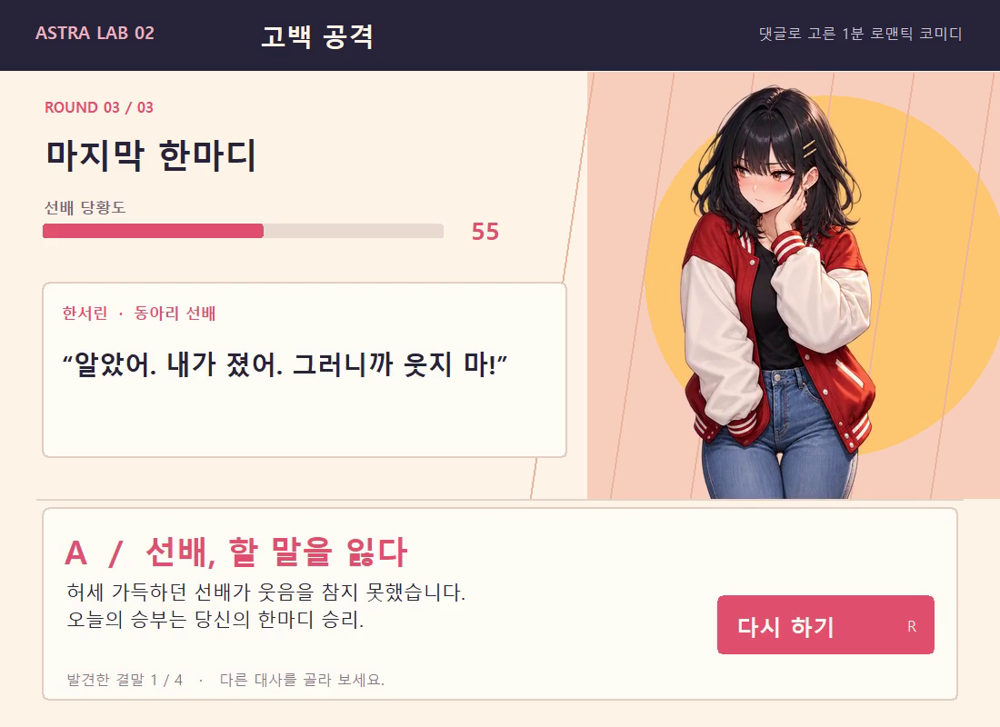

# 고백 공격 · 댓글 미션 02

허세 가득한 대학 동아리 선배에게 한마디로 반격하는 짧은 코미디 게임입니다. 대사를 고르고, 움직이는 바에 맞춰 SPACE를 누르세요. 세 번의 대화 끝에 네 가지 결말 중 하나를 만납니다.



## 실행 방법 · Windows

1. Python 3.11 이상이 설치된 PC에서 [게임 ZIP](confession-counter.zip)을 내려받고 압축을 풉니다.
2. 압축을 푼 폴더의 주소창에 `cmd`를 입력하고 Enter를 누릅니다.
3. 아래 두 줄을 차례로 실행합니다.

```console
py -3 -m pip install -r requirements.txt
py -3 game.py
```

Python 실행 명령을 찾을 수 없다고 나오면 Python을 먼저 설치해 주세요. 이 게임에는 Pillow와 Tk가 필요합니다. Windows의 일반 Python 설치에 포함된 Tk로 실행을 확인했습니다.

| 조작 | 키 |
|---|---|
| 시작 | Enter |
| 대사 선택 | 마우스 또는 1·2·3 |
| 타이밍 맞추기 | Space 또는 Enter |
| 다음 대화 | Enter |
| 결말에서 다시 하기 | R 또는 Enter |
| 메뉴 | Esc |

분홍색 구간은 PERFECT, 초록색은 GOOD입니다. 성공하면 당황도에 보너스를 받습니다. 대사 선택과 누적 수치에 따라 결말이 갈립니다. 결말 수집은 실행 중에만 유지됩니다.

## 어떻게 정했나요?

[모집 글](https://gall.dcinside.com/mgallery/board/view/?id=thesingularity&no=1398996)을 2026년 9월 7일 21:44:25부터 21:54:25까지 10분 동안 열었습니다. SVG는 제외했습니다. 마감 전 유효 제안 5개가 모두 대댓글 0개여서, 공지한 동률 기준에 따라 가장 먼저 올라온 **“일진녀에게 고백 공격하고 혼내주기”**를 골랐습니다.

가상의 대학생 캐릭터가 나오는 선택지·타이밍 게임으로 만들었습니다. 코드와 대사·화면 제작에 Codex AI를, 캐릭터 그림에 이미지 생성을 사용했습니다. [그림 생성 기록](ASSETS.md)을 함께 공개합니다.

## 확인한 내용

- Windows / Python 3.11에서 실제 창을 조작해 S 결말과 A 결말, 다시 하기를 확인했습니다.
- 27개 대사 선택 조합을 계산해 네 결말에 모두 도달할 수 있는지 확인했습니다. 네 결말을 모두 수동 플레이한 것은 아닙니다.
- 게임 창만 녹화한 실제 플레이를 2배속으로 편집해 60초 영상으로 만들었습니다. 전체 코딩 과정을 녹화한 영상은 아닙니다.
- 게임 자체에는 네트워크 접속, 로그인, 저장 파일 작성 기능이 없습니다. 최초 Pillow 설치에는 인터넷이 필요합니다.

소규모 실험판이며 다른 PC에서의 실행은 확인하지 않았습니다.
